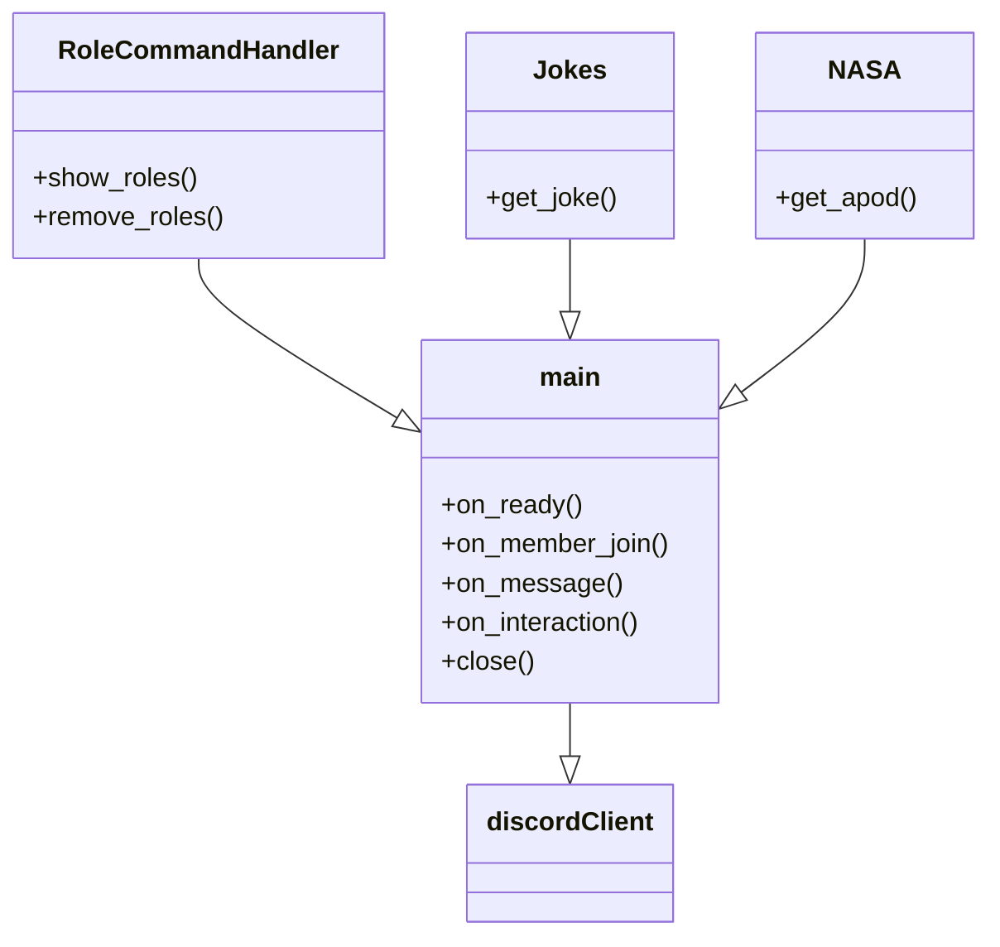

```mermaid
classDiagram
	class discordClient {
	}
	
    class main {
        +on_ready()
        +on_member_join()
        +on_message()
        +on_interaction()
        +close()
    }
    
    class RoleCommandHandler {
        +show_roles()
        +remove_roles()
    }

    class Jokes {
        +get_joke()
    }

    class NASA {
        +get_apod()
    }

	main --|> discordClient
    RoleCommandHandler --|> main
    Jokes --|> main
    NASA --|> main

```
